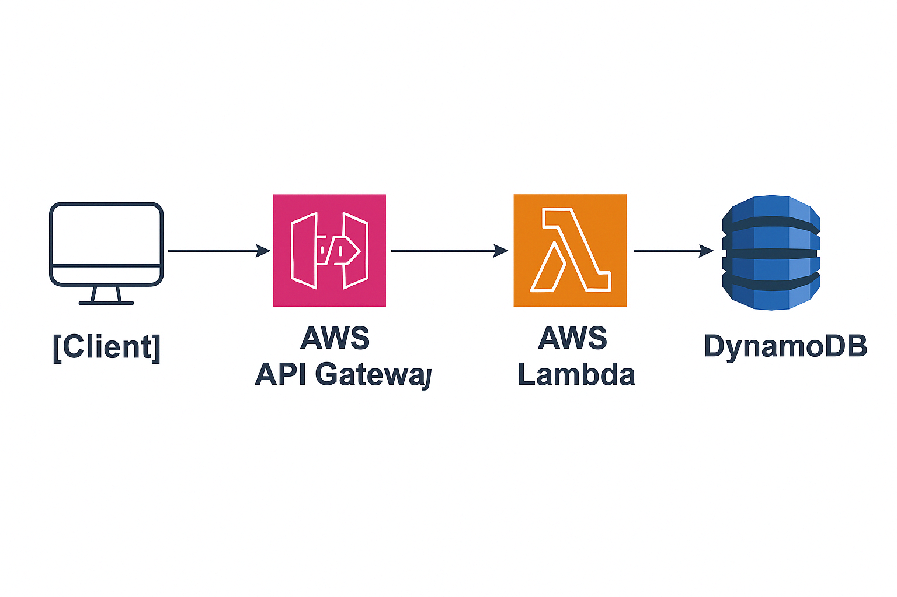

# Serverless Task Manager: AWS Lambda + API Gateway + DynamoDB

This is a **fully serverless architecture project** built with AWS managed services using the Free Tier. It provides a simple RESTful API for managing tasks (ToDo list) without the need for traditional backend infrastructure.

## Architecture

```plaintext
[Client] > [API Gateway] > [AWS Lambda] > [DynamoDB]
```

- **API Gateway**: Exposes the RESTful API endpoints.
- **AWS Lambda**: Handles the business logic for task operations.
- **DynamoDB**: NoSQL database to store task data.

## Available Endpoints

| Method | Endpoint       | Description               |
|--------|----------------|---------------------------|
| POST   | `/tasks`       | Create a new task         |
| GET    | `/tasks`       | Retrieve all tasks        |
| GET    | `/tasks/{id}`  | Retrieve a task by ID     |
| DELETE | `/tasks/{id}`  | Delete a task by ID       |

### Sample JSON for POST `/tasks`
```json
{
  "title": "Call the plumber"
}
```

## Technologies Used

- AWS Lambda (Python 3.11)
- Amazon API Gateway (REST API)
- Amazon DynamoDB
- IAM (role-based access)
- Postman / curl for API testing
- AWS Console

## Security Notes

This project does not include authentication, but is ready to be extended with:
- Amazon Cognito (OAuth2 / JWT)
- API Gateway API Keys
- Fine-grained IAM roles per Lambda function

## How to Deploy (Quick Guide)

1. Create an AWS Free Tier account
2. Create a `Tasks` table in DynamoDB with `id` as partition key
3. Create Lambda functions: `create_task`, `get_all_tasks`, `get_task`, `delete_task`
4. Attach IAM permissions to allow access to DynamoDB
5. Create a REST API in API Gateway with `/tasks` and `/tasks/{id}` routes
6. Connect each route to the appropriate Lambda function
7. Deploy the API to a `dev` stage
8. Test with Postman or curl

## Screenshots / Architecture Diagram (optional)

 

## Author

Antonio Martel  
[Blog](https://www.antoniomartel.com) - [LinkedIn](https://www.linkedin.com/in/antoniomartel/)

---

This project is part of my portfolio as a **technical consultant and cloud solutions architect**.
